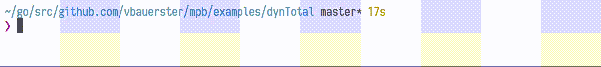

# Multi Progress Bar

[](https://godoc.org/github.com/vbauerster/mpb)
[](https://travis-ci.org/vbauerster/mpb)
[](https://goreportcard.com/report/github.com/vbauerster/mpb)
[](https://codecov.io/gh/vbauerster/mpb)

**mpb** is a Go lib for rendering progress bars in terminal applications.

## Features

* __Multiple Bars__: Multiple progress bars are supported
* __Dynamic Total__: [Set total](https://github.com/vbauerster/mpb/issues/9#issuecomment-344448984) while bar is running
* __Dynamic Addition__: Additional bar could be added at later time
* __Dynamic Removal__: Remove particular bar, before or after completion
* __Dynamic Resize__: Adaptive bar resize (doesn't work inside tmux)
* __Cancellation__: Cancel whole rendering process
* __Predefined Decoratros__: Elapsed time, [Ewmaest](https://github.com/dgryski/trifles/tree/master/ewmaest) based ETA, Percentage, Bytes counter
* __Decorator's width sync__:  Synchronized decorator's width among multiple bars

## Installation

```sh
go get github.com/vbauerster/mpb
```

_Note:_ it is preferable to go get from github.com, rather than gopkg.in. See issue [#11](https://github.com/vbauerster/mpb/issues/11).

## Usage

#### [Rendering single bar](examples/singleBar/main.go)
```go
	p := mpb.New(
		// override default (80) width
		mpb.WithWidth(100),
		// override default "[=>-]" format
		mpb.WithFormat("╢▌▌░╟"),
		// override default 100ms refresh rate
		mpb.WithRefreshRate(120*time.Millisecond),
	)

	total := 100
	name := "Single Bar:"
	// Add a bar
	// You're not limited to just a single bar, add as many as you need
	bar := p.AddBar(int64(total),
		// Prepending decorators
		mpb.PrependDecorators(
			// StaticName decorator with minWidth and no extra config
			// If you need to change name while rendering, use DynamicName
			decor.StaticName(name, len(name), 0),
			// ETA decorator with minWidth and no extra config
			decor.ETA(4, 0),
		),
		// Appending decorators
		mpb.AppendDecorators(
			// Percentage decorator with minWidth and no extra config
			decor.Percentage(5, 0),
		),
	)

	for i := 0; i < total; i++ {
		time.Sleep(time.Duration(rand.Intn(10)+1) * time.Second / 100)
		bar.Increment()
	}

	p.Stop()
```

#### [Rendering multiple bars](examples/simple/main.go)
```go
	var wg sync.WaitGroup
	p := mpb.New(mpb.WithWaitGroup(&wg))
	total := 100
	numBars := 3
	wg.Add(numBars)

	for i := 0; i < numBars; i++ {
		name := fmt.Sprintf("Bar#%d:", i)
		bar := p.AddBar(int64(total),
			mpb.PrependDecorators(
				decor.StaticName(name, 0, 0),
				// DSyncSpace is shortcut for DwidthSync|DextraSpace
				// means sync the width of respective decorator's column
				// and prepend one extra space.
				decor.Percentage(3, decor.DSyncSpace),
			),
			mpb.AppendDecorators(
				decor.ETA(2, 0),
			),
		)
		go func() {
			defer wg.Done()
			for i := 0; i < total; i++ {
				time.Sleep(time.Duration(rand.Intn(10)+1) * time.Second / 100)
				bar.Increment()
			}
		}()
	}
	// Wait for incr loop goroutines to finish,
	// and shutdown mpb's rendering goroutine
	p.Stop()
```

#### [Dynamic Total](examples/dynTotal/main.go)



#### [Adaptive resize](examples/prependETA/main.go)


_Note:_ don't expect much, it corrupts if resizing too fast.

#### [Bytes counter decorator](examples/io/multiple/main.go)


Typeface used in screen shots: [Iosevka](https://be5invis.github.io/Iosevka)
