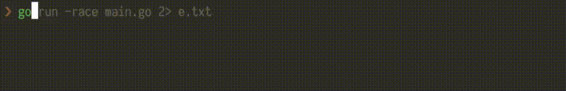
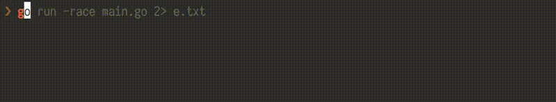
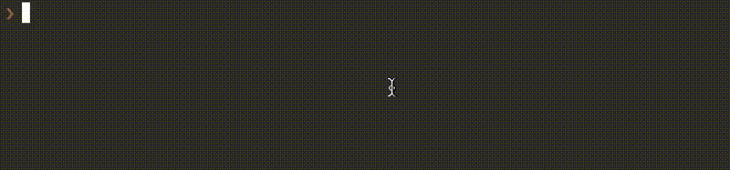
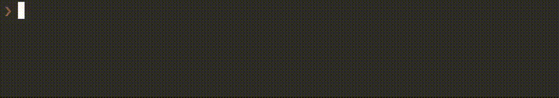
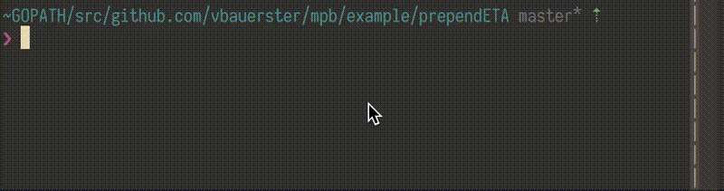
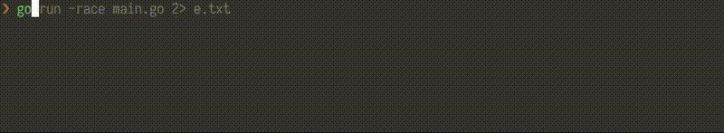

# Multi Progress Bar [](https://godoc.org/github.com/vbauerster/mpb) [](https://travis-ci.org/vbauerster/mpb)

**mpb** is a Go lib for rendering progress bars in terminal applications.

It is inspired by [uiprogress](https://github.com/gosuri/uiprogress) library,
but unlike the last one, implementation is mutex free, following Go's idiom:

> Don't communicate by sharing memory, share memory by communicating.

## Features

* __Multiple Bars__: mpb can render multiple progress bars that can be tracked concurrently
* __Cancellable__: cancel rendering goroutine at any time
* __Dynamic Addition__:  Add additional progress bar at any time
* __Dynamic Removal__:  Remove rendering progress bar at any time
* __Dynamic Sorting__:  Sort bars as you wish
* __Dynamic Resize__:  Resize bars on terminal width change
* __Custom Decorator Functions__: Add custom functions around the bar along with helper functions
* __Dynamic Decorator's Width Sync__:  Sync width among decorator group (available since v2)
* __Predefined Decoratros__: Elapsed time, [Ewmaest](https://github.com/dgryski/trifles/tree/master/ewmaest) based ETA, Percentage, Bytes counter

## Installation

To get the package, execute:

```sh
go get gopkg.in/vbauerster/mpb.v1
```

```sh
go get gopkg.in/vbauerster/mpb.v2
```

## Usage

Following is the simplest use case:

```go
	// Star mpb's rendering goroutine.
	p := mpb.New()
	// Set custom width for every bar, which mpb will render
	// The default one in 70
	p.SetWidth(80)
	// Set custom format for every bar, the default one is "[=>-]"
	p.Format("╢▌▌░╟")
	// Set custom refresh rate, the default one is 100 ms
	p.RefreshRate(120 * time.Millisecond)

	// Add a bar. You're not limited to just one bar, add many if you need.
	bar := p.AddBar(100).PrependName("Single Bar:", 0, 0).AppendPercentage(5, 0)

	for i := 0; i < 100; i++ {
		bar.Incr(1) // increment progress bar
		time.Sleep(time.Duration(rand.Intn(100)) * time.Millisecond)
	}

	// Don't forget to stop mpb's rendering goroutine
	p.Stop()

	// You cannot add bars after p.Stop() has been called
	// p.AddBar(100) // will panic
```

Running [this](example/singleBar/main.go), will produce:


However **mpb** was designed with concurrency in mind. Each new bar renders in its
own goroutine, therefore adding multiple bars is easy and safe:

```go
	var wg sync.WaitGroup
	p := mpb.New()
	wg.Add(3) // add wg delta
	for i := 0; i < 3; i++ {
		name := fmt.Sprintf("Bar#%d:", i)
		bar := p.AddBar(100).
			PrependName(name, len(name), 0).
			// Prepend Percentage decorator and sync width
			PrependPercentage(3, mpb.DwidthSync|mpb.DextraSpace).
			// Append ETA and don't sync width
			AppendETA(2, 0)
		go func() {
			defer wg.Done()
			// you can p.AddBar() here, but ordering will be non deterministic
			// if you still need p.AddBar() here and maintain ordering, use
			// (*mpb.Progress).BeforeRenderFunc(f mpb.BeforeRender)
			for i := 0; i < 100; i++ {
				bar.Incr(1)
				time.Sleep(time.Duration(rand.Intn(100)) * time.Millisecond)
			}
		}()
	}
	wg.Wait() // Wait for goroutines to finish
	p.Stop()  // Stop mpb's rendering goroutine
```



The source code: [example/simple/main.go](example/simple/main.go)

### Cancel

To cancel use either
[WithCancel](https://godoc.org/github.com/vbauerster/mpb#Progress.WithCancel) or
[WithContext](https://godoc.org/github.com/vbauerster/mpb#Progress.WithContext)
method. The last one requires Go 1.7



The source code: [example/cancel/main.go](example/cancel/main.go)

### Removing bar



The source code: [example/remove/main.go](example/remove/main.go)

### Sorting bars by progress



The source code: [example/sort/main.go](example/sort/main.go)

### Resizing bars on terminal width change



The source code: [example/prependETA/main.go](example/prependETA/main.go)

### Multiple io



The source code: [example/io/multiple/main.go](example/io/multiple/main.go)

### Custom Decorators

Refer to godoc [example](https://godoc.org/github.com/vbauerster/mpb#example-Bar-PrependFunc).

## License

[MIT](https://github.com/vbauerster/mpb/blob/master/LICENSE)

The typeface used in screen shots: [Iosevka](https://be5invis.github.io/Iosevka)
