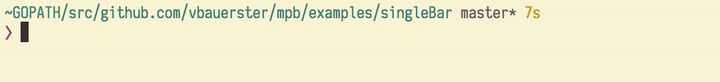
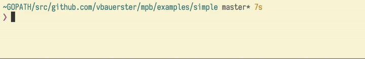
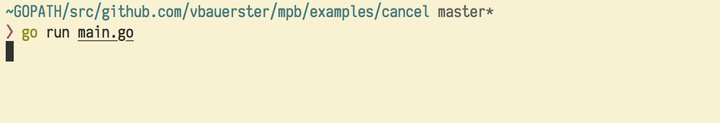
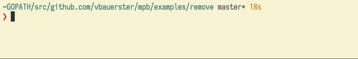
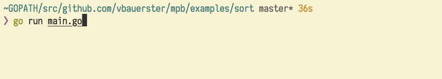
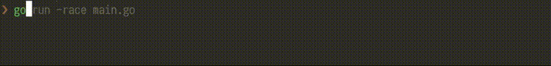

# Multi Progress Bar

[](https://godoc.org/github.com/vbauerster/mpb)
[](https://travis-ci.org/vbauerster/mpb)
[](https://goreportcard.com/report/github.com/vbauerster/mpb)
[](https://codecov.io/gh/vbauerster/mpb)

**mpb** is a Go lib for rendering progress bars in terminal applications.

## Features

* __Multiple Bars__: mpb can render multiple progress bars that can be tracked concurrently
* __Cancellable__: cancel rendering goroutine at any time
* __Dynamic Addition__:  Add additional progress bar at any time
* __Dynamic Removal__:  Remove rendering progress bar at any time
* __Dynamic Sorting__:  Sort bars as you wish
* __Dynamic Resize__:  Resize bars on terminal width change
* __Custom Decorator Functions__: Add custom functions around the bar along with helper functions
* __Dynamic Decorator's Width Sync__:  Sync width among decorator group (available since v2)
* __Predefined Decoratros__: Elapsed time, [Ewmaest](https://github.com/dgryski/trifles/tree/master/ewmaest) based ETA, Percentage, Bytes counter

## Installation

To get the package, execute:

```sh
go get gopkg.in/vbauerster/mpb.v3
```

## Usage

Following is the simplest use case:

```go
	p := mpb.New(
		// override default (80) width
		mpb.WithWidth(100),
		// override default "[=>-]" format
		mpb.WithFormat("╢▌▌░╟"),
		// override default 100ms refresh rate
		mpb.WithRefreshRate(120*time.Millisecond),
	)

	total := 100
	name := "Single Bar:"
	// Add a bar
	// You're not limited to just a single bar, add as many as you need
	bar := p.AddBar(int64(total),
		// Prepending decorators
		mpb.PrependDecorators(
			// StaticName decorator with minWidth and no extra config
			// If you need to change name while rendering, use DynamicName
			decor.StaticName(name, len(name), 0),
			// ETA decorator with minWidth and no extra config
			decor.ETA(4, 0),
		),
		// Appending decorators
		mpb.AppendDecorators(
			// Percentage decorator with minWidth and no extra config
			decor.Percentage(5, 0),
		),
	)

	for i := 0; i < total; i++ {
		time.Sleep(time.Duration(rand.Intn(10)+1) * time.Second / 100)
		bar.Increment()
	}

	p.Stop()
```

Running [this](examples/singleBar/main.go), will produce:



However **mpb** was designed with concurrency in mind. Each new bar renders in its
own goroutine, therefore adding multiple bars is easy and safe:

```go
	var wg sync.WaitGroup
	p := mpb.New(mpb.WithWaitGroup(&wg))
	total := 100
	numBars := 3
	wg.Add(numBars)

	for i := 0; i < numBars; i++ {
		name := fmt.Sprintf("Bar#%d:", i)
		bar := p.AddBar(int64(total),
			mpb.PrependDecorators(
				decor.StaticName(name, 0, 0),
				// DSyncSpace is shortcut for DwidthSync|DextraSpace
				// means sync the width of respective decorator's column
				// and prepend one extra space.
				decor.Percentage(3, decor.DSyncSpace),
			),
			mpb.AppendDecorators(
				decor.ETA(2, 0),
			),
		)
		go func() {
			defer wg.Done()
			for i := 0; i < total; i++ {
				time.Sleep(time.Duration(rand.Intn(10)+1) * time.Second / 100)
				bar.Increment()
			}
		}()
	}
	// Wait for incr loop goroutines to finish,
	// and shutdown mpb's rendering goroutine
	p.Stop()
```



The source code: [examples/simple/main.go](examples/simple/main.go)

### Cancel



The source code: [examples/cancel/main.go](examples/cancel/main.go)

### Removing bar



The source code: [examples/remove/main.go](examples/remove/main.go)

### Sorting bars by progress



The source code: [examples/sort/main.go](examples/sort/main.go)

### Resizing bars on terminal width change


The source code: [examples/prependETA/main.go](examples/prependETA/main.go)

### Multiple io



The source code: [examples/io/multiple/main.go](examples/io/multiple/main.go)

## License

[BSD 3-Clause](https://opensource.org/licenses/BSD-3-Clause)

The typeface used in screen shots: [Iosevka](https://be5invis.github.io/Iosevka)
